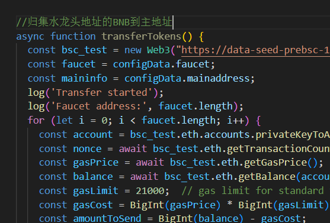

-- {
    "mainaddress": {
        "address": "0x79832xxxxx31ExxxxxxDxxxxx44036",
        "privatekey": "978cf410765xxxxeab1173462c80c4857fd50e"
    },
    "faucet": [
        "52f8d1ef950f4exxxx7fc533e771e406ec81d85",
        "caba220256xxxxx844530e0e0c04930c8526b",
        "94835f4346xxxxxxxa65f5d6825"
    ],
    "targtaddress": [
        "0x418FBF3073DaC2E8xxxxxxx36888868eDD374b9",
        "0xA5E697997ce9Exxxxxxx765CB5b637DC54a",
        "0x6e9a2757D07974xxxxxxxxD"
    ]
}
使用本脚本只需要再config.json中将mainaddress中的address和privatekey改成自己有测试BNB代币的钱包
faaucet是其他有测试BNB的钱包的私钥，填好后可以自己手动改一下index.js中的这个方法

targtaddress是你要归集nlk测试代币的地址